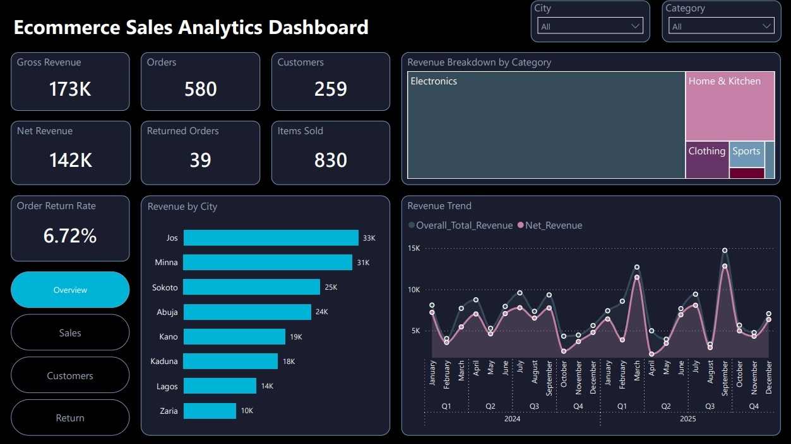
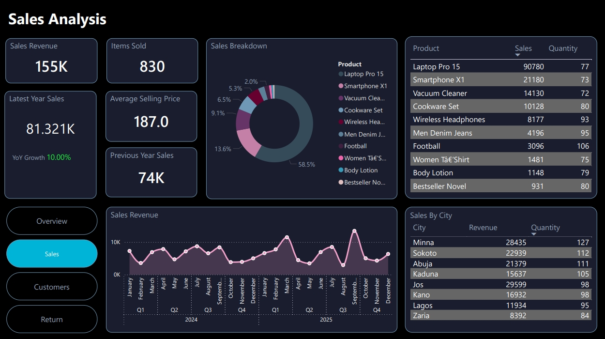
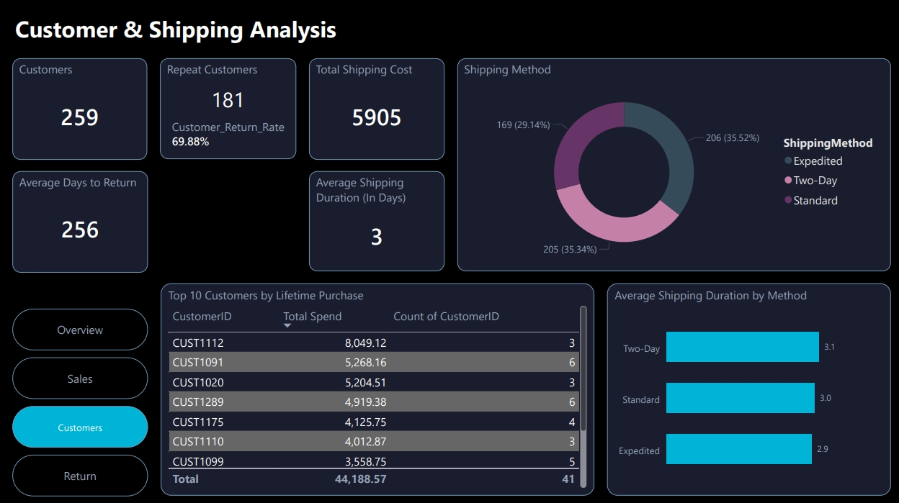
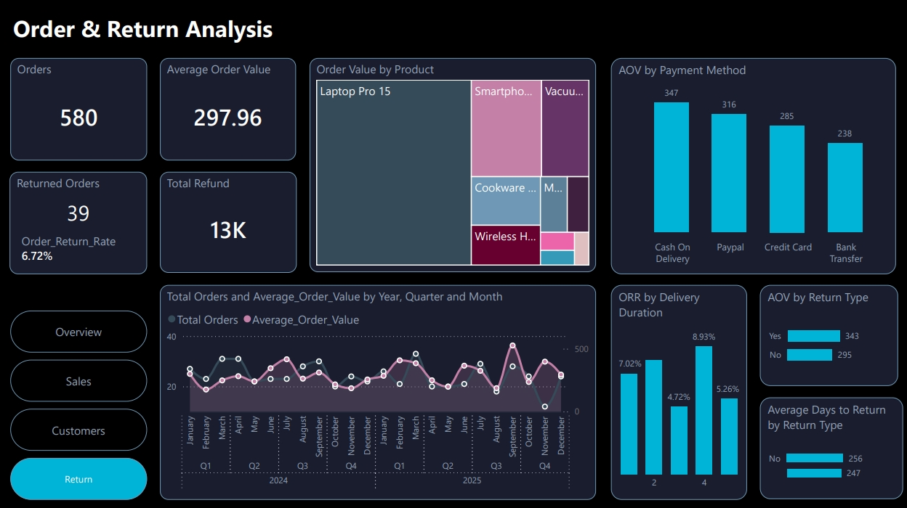

# **E-Commerce Sales Analytics Dashboard**

## **Overview**

This project is an end-to-end data analytics solution built to analyze the performance of a mid-sized e-commerce business. It covers the full workflow from data cleaning and transformation to visualization and insight generation.

The goal is to provide clear insights into sales performance, customer behavior, product trends, and operational efficiency.

## **Tools Used**

* Excel (data cleaning)  
* MySQL (data transformation)  
* Power BI (data modeling and visualization)

## **Dashboard Summary**

The dashboard is divided into four main sections:

* **Overview:** Key metrics such as revenue, orders, customers, and return rate  
* **Sales Analysis:** Revenue trends and product performance  
* **Customer & Shipping Analysis:** Customer behavior and delivery performance  
* **Order & Return Analysis:** Returns, refunds, and order patterns

## **Key Insights**

* Sales show consistent growth with a 10% year-over-year increase  
* A small number of products generate a large share of revenue  
* Customer retention is high, with most customers making repeat purchases  
* Revenue is concentrated in a few cities  
* Return rate is moderate and linked to delivery performance

## **Project Structure**

ecommerce-sales-analytics-dashboard/  
│  
├── data/              \# Raw and cleaned datasets  
├── dashboard/         \# Power BI file (.pbix)  
├── sql/               \# SQL scripts and views  
├── images/            \# Dashboard screenshots  
├── docs/              \# Methodology  
├── report.pdf         \# Full report  
└── README.md

## **Dashboard Preview**

## **How to Use**

1. Download the Power BI file from the `dashboard/` folder  
2. Open it using Power BI Desktop  
3. Use filters and slicers to explore the data

## **Author**

Muhammad Ahmad Yusuf  
Software Engineering Student, Bayero University

